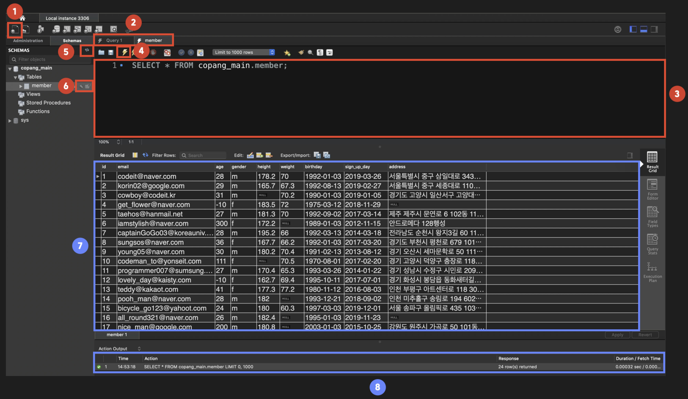

1. 쿼리 창 생성 아이콘

- 1번 아이콘을 클릭하면 3번과 같이 SQL 문을 쓸 수 있는 SQL 에디터(우리는 '쿼리 창'이라고 부릅시다) 탭을 새롭게 열 수 있습니다. 그때마다 2번 영역에서 탭의 개수가 늘어나게 될 겁니다.

2. 쿼리 창 탭

- 쿼리 창 생성 아이콘을 누를 때마다 이 영역에 존재하는 탭의 개수가 늘어나게 됩니다.

3. 쿼리 창

- SQL 문을 입력할 수 있는 공간입니다.

4. SQL 문 실행 아이콘

- 쿼리창에 입력한 SQL 문을 실행해줍니다. 저는 영상에서 매번 SQL 문을 실행할 때마다 직접 이 아이콘을 클릭해줄 건데요. 혹시 단축키를 사용하고 싶으신 분은 '시프트 + 커맨드(윈도우는 컨트롤) + 엔터'를 치셔도 됩니다.

5. 새로고침 아이콘

- 데이터베이스를 새로 생성하거나, 데이터베이스에 테이블을 새로 추가했을 때 새로고침 버튼을 눌러야 그것을 확인할 수 있습니다.

6. 테이블 조회 아이콘

- 왼쪽의 스패너 모양 아이콘은 해당 테이블의 컬럼과 각 컬럼의 데이터 타입 등을 볼 수 있게 해주는 아이콘이고,
- 오른쪽의 표 모양의 아이콘은 테이블의 전체 row를 조회할 수 있게 해주는 아이콘입니다.

7. Result Grid 영역
   SQL 문으로 테이블의 데이터를 조회했을 때 그 조회 결과가 출력되는 영역입니다.

8. Action Output 영역
   SQL 문을 실행했을 때, 실행이 잘 되었는지 등에 관한 정보를 보여주는 영역입니다. 지금 보면 가장 왼쪽에 초록불이 떠있는데요. 이는 SQL 문이 정상 실행되었다는 뜻입니다. 만약 여기에 빨간 불이 떠있다면 SQL 문 실행이 실패했다는 뜻입니다. 그리고 그 이유(에러 메시지)도 이 영역의 Response 탭에서 확인할 수 있습니다.
