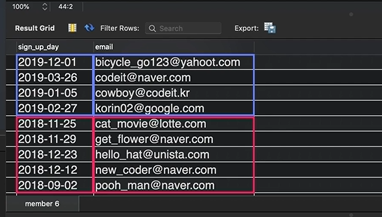

## 이스케이핑(escaping)

- 어떤 문자가 그것에 부여된 특정한 의미, 기능으로 해석되는 게 아니라 그냥 단순한 문자 하나로 해석되도록 하는 것

```
SELECT * FROM test WHERE sentence LIKE '%\%%';
# 문자 앞에 \ 붙임

SELECT * FROM test WHERE sentence LIKE BINARY '%g%';
# BINARY 사용함으로써 대소문자 구분
# BINARY 사용 안 하면 g, G 둘다 나옴
```

## 데이터 정렬

- 정렬 : row들을 특정 컬럼을 기준으로 순서대로 출력

```
SELECT * FROM member ORDER BY height;
# height를 기준으로 오름차순 정렬
# NULL은 작은 수로 취급(MySQL에서는)

SELECT * FROM member ORDER BY height DESC;
# DESC : 내림차순 정렬

SELECT * FROM member
WHERE gender = 'm' AND weight >= 70
ORDER BY height;

SELECT sign_up_day, email FROM member
ORDER BY YEAR(sign_up_day) DESC, email ASC;
# sign_up_day의 연도를 기준으로 내림차순 정렬한 다음,
# email 기준으로 내림차순 정렬
# 이름을 먼저 쓴 컬럼을 우선으로 해서 정렬이 차례대로 수행됨
```



## 문자열을 정수형으로 변경한 후, 데이터 정렬

- CAST(data AS signed) : data 컬럼에 존재하는 값들의 데이터 타입을 일시적으로 signed라는 데이터 타입으로 변환
  - signed : 양수와 음수를 포함한 모든 정수
  - decimal : 실수

```
SELECT * FROM ordering_test ORDER BY CAST(data AS signed);
```

## 데이터 일부만 추려보기

- LIMIT n
- LIMIT m, n

```
SELECT * FROM member
ORDER BY sign_up_day DESC
LIMIT 10;
# LIMIT : row 10개만 보여줌

SELECT * FROM member
ORDER BY sign_up_day DESC
LIMIT 8, 2;
# row는 0번째부터 시작
# 8번째(사실은 9번째) row부터 2개만 보여줌
```
