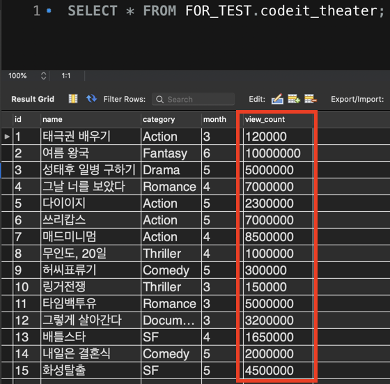

## 서브쿼리

- SQL 문 안에 '부품'처럼 들어가는 SELECT 문
- 괄호로 서브 쿼리문을 감싸야 함

```
SELECT i.id, i.name, AVG(r.star) AS avg_star
FROM item AS i LEFT OUTER JOIN review AS r
ON r.item_id = i.id
GROUP BY i.id, i.name
HAVING avg_star < (SELECT AVG(star) FROM review)
ORDER BY avg_star DESC;
```

## SELECT 절에 있는 서브쿼리

```
SELECT
  id,
  name,
  price,
  (SELECT MAX(price) FROM item) AS max_price
FROM copang_main.item;
```

## WHERE 절에 있는 서브쿼리

```
SELECT
  id,
  name,
  price,
  (SELECT AVG(price) FROM item) AS avg_price
FROM item
WHERE price = (SELECT MAX(price) FROM item);
```

### IN

```
SELECT * FROM item
WHERE id IN
(
SELECT item_id
FROM review
GROUP BY item_id HAVING COUNT(*) >= 3
);
```

### ANY, SOME

- 서브쿼리의 결과에 있는 각 row의 값들 중 하나라도 조건을 만족하면 True를 리턴함



```
# 결국 아래 코드의 경우, 서브쿼리의 결과의 값 중 최소값보다 큰 값이면 조건을 만족하게 됨

SELECT * FROM codeit_theater
WHERE view_count > SOME(SELECT view_count FROM codeit_theater WHERE category = 'ACTION)
  AND category != 'ACTION;
```

### ALL

- 서브쿼리의 결과에 있는 각 row의 값들 중 모든 조건을 만족해야 True를 리턴함

```
# 결국 아래 코드의 경우, 서브쿼리의 결과의 값 중 최댓값보다 큰 값이어야 조건을 만족하게 됨

SELECT * FROM codeit_theater
WHERE view_count > ALL(SELECT view_count FROM codeit_theater WHERE category = 'ACTION)
  AND category != 'ACTION;
```
