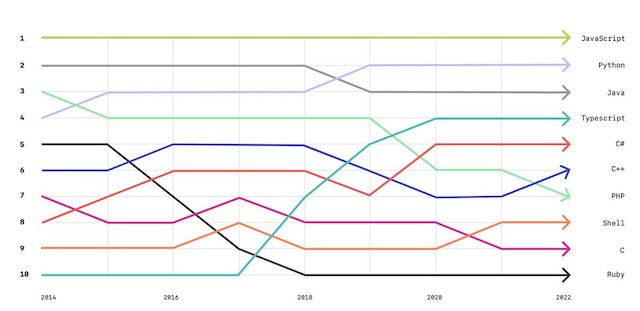

# TypeScript
## 타입스크립트의 특징
### 1. JavaScript + 타입 체크 = TypeScript
  - 그렇기 때문에 타입 스크립트를 코딩하면 100% 동작함
  - 하지만 자바 스크립트 실행 환경에 타입 스크립트를 코딩하면 동작하지 않음
### 2. 데이터 타입 체크
  - 자바 스크립트의 변수는 종이컵과 같음
  - 종이컵은 액체를 담기 편리하지만, 그 내용물을 정확히 알 수 없어 매번 확인해야 하는 불안한 상황이 생김
  - 이처럼 자바 스크립트에서는 변수의 데이터 타입을 명확하게 알기 어렵기 때문에 데이터 타입의 안정성이 낮음
  - 타입 스크립트는 페트병이 등장한 것과 같은 혁신
  - 페트명에는 내용물이 명확하게 표시되어 있고, 봉인되어 불순물이 없음이 보장됨
  - 타입 스크립트는 변수의 데이터 타입을 명확하게 지정해줘 안정성을 높임

## 왜 사용해야 하는가?
- 자바 스크립트에 타입 체크 기능을 추가할 수 있음
- 타입 스크립트의 문법은 아는 만큼, 원하는 만큼 사용할 수 있음
- github에 따르면, 타입 스크립트는 4번째로 인기있는 언어가 되었음


## TypeScript 실습환경 - 내 컴퓨터에서 실행하기
1. Node.js 설치
  - 타입 스크립트를 사용하기 전에, 먼저 Node.js를 설치해야 함
  - LTS(Long Term Support) 버전을 설치(https://nodejs.org/)
2. 타입 스크립트 설치
  - Node.js를 설치한 후, 다음 명령어로 타입 스크립트를 설치
  ```
  npm install typescript --save-dev
  ```
3. 프로젝트 초기화
  - 타입 스크립트 프로젝트를 초기화하려면 다음 명령어를 실행해야 함
  - 이 명령어는 tsconfig.json 파일을 생성함
  ```
  npx tsc --init
  ```
  - tsconfig.json 파일을 열고 다음 설정을 추가
  - 이 설정은 'src' 폴더에 있는 모든 타입 스크립트 파일을 컴파일하고, 결과를 build 폴더에 저장
  ```
  {
    "include": ["src"],
    "compilerOptions": {
      "outDir": "./build"
    }
  }
  ```
4. 타입 스트립트 컴파일
  - 타입 스크립트 컴파일러를 사용하려면 다음 명령어를 실행해야 함
  ```
  npx tsc
  ```
  - 타입 스크립트 파일의 변경 사항을 실시간으로 감지하고, 컴파일하려면 다음 명령어를 실행해야 함
  ```
  npx tsc --watch
  ```

## TypeScript의 데이터 타입과 추론
### 왜 데이터 타입이 그렇게 중요한가?
- 자바 스크립트의 변수에는 어떤 데이터 타입의 값도 할당될 수 있음
```
let myname = 'egoing';
```
- 그런데 누군가 myname을 실수로 아래와 같이 변경
```
myname = 1;
```
- 자바 스크립트는 이런 문제를 사전에 막아주지 못 함
- 사용자가 프로그램을 사용하다가 나중에 버그를 발견하게 됨

## 변수에 데이터 타입을 지정하는 방법
- 타입 스크립트는 위와 같은 문제를 변수 선언 시 데이터 타입을 지정하며 해결함
- 이렇게 하면, 타입 스크립트를 자바 스크립트로 컴파일할 때 데이터 타입에 다른 값이 할당되려 할 때 오류를 발생시켜 개발자에게 알려줌
- 이를 통해 코딩할 때 버그를 잡을 수 있음
```
let myname: string = 'egoing';
```
- 위 예시에서는 myname 변수에 string 타입을 지정했음
- 이제 myname에 숫자 타입을 할당하려 하면, 컴파일 에러가 발생함
```
// 아래 코드는 오류를 발생시킵니다.
myname = 1;
```

## 데이터 타입의 종류
- 타입 스크립트에서는 다양한 데이터 타입을 지원함
- 이러한 데이터 타입은 크게 기본 데이터 타입, 객체 타입, 특수 타입으로 나눌 수 있음
- 데이터 타입을 이용하면, 코드의 안정성을 높이고 개발자들이 더 효율적으로 협업할 수 있음

### 기본 데이터 타입
- number: 숫자 타입으로, 정수와 실수를 포함
- string: 문자열 타입
- boolean: 참(true) / 거짓(false)을 나타내는 불리언 타입
- null: 값이 없음을 나타냄
- undefined: 값이 할당되지 않은 변수의 기본값인 타입  

### 객체 타입
- object: 객체를 나타내는 타입
- array: 동일한 타입의 요소를 가진 배열을 나타내는 타입  
  - 첫 번째 방법: 타입 + []
    ```
    let arr1: number[] = [1, 2, 3];  
    ```
  - 두 번째 방법: Array<타입>
    ```
    let arr2: Array = [1, 2, 3];  
    ```
  두 가지 방법 모두 결과는 동일함. 취향 차이  
<br>

- tuple: 각 요소가 다른 타입을 가질 수 있는 배열을 나타내는 타입(TS 전용)  
  - Tuple은 고정된 길이와 타입의 배열  
  - 각 요소의 타입과 순서가 정해져 있음  
  - 이는 JavaScript에는 없는 데이터 타입이며, TypeScript에서만 제공  
  ```
  let tuple: [string, number, boolean] = ['Hello', 42, true];  
  ```
  - 위 예시에서 tuple이라는 변수의 길이는 3이고, 각각 string, number, boolean 타입을 가지는 tuple을 선언함
<br>

- Array와 Tuple의 차이점
  - Array는 길이가 가변적이며, 동일한 타입의 요소로 구성  
  - Tuple은 길이가 고정되어 있으며, 각 요소의 타입이 정해져 있음  
  - JavaScript에는 없는 데이터 타입이며, TypeScript에서만 사용할 수 있음

### 특수 타입
- any: 어떠한 타입이든 할당될 수 있는 타입(TS 전용)
- unknown: 타입을 미리 알 수 없는 경우에 사용되는 타입  
이 타입은 안전한 타입 검사를 위해 사용(TS 전용)
- never: 절대 발생하지 않는 값의 타입을 나타냄  
예를 들어, 함수가 항상 예외를 발생시키거나 무한 루프를 실행할 때, 이 타입을 사용할 수 있음(TS 전용)

### 타입 추론 기능
- 타입스크립트는 타입 추론 기능을 통해 변수의 타입을 자동으로 판단할 수 있음
- 즉, 명시적으로 타입을 지정하지 않아도 타입스크립트 컴파일러가 초기에 할당된 값을 바탕으로 변수의 타입을 추론
```
let age = 30;
```
- 위 코드에서 age 변수에 명시적으로 타입을 지정하지 않았지만, 초기 값으로 숫자 30을 할당함
- 이때 타입 스크립트는 age 변수의 타입을 자동적으로 number로 추론함
- 타입 추론은 코드를 간결하게 작성할 수 있도록 도와주지만, 때로는 명시적으로 타입을 지정하는 것이 더 명확할 수 있음
- 타입 추론이 모호한 경우나 복잡한 로직에서는 타입을 명시해주는 것이 좋음

## TypeScript에서 객체의 데이터 타입
- 타입 스크립트에서 객체의 데이터 타입을 정의하려면, 타입 주석을 사용하여 객체의 속성과 해당 속성의 데이터 타입을 명시하면 됨
- 객체의 데이터 타입을 지정하는 것은 개발자가 코드를 더 명확하게 이해하고, 에러를 줄이는데 도움이 됨
```
const user = {
  name: "John",
  age: 25
};
```
- 타입 스크립트에서 위의 객체의 데이터 타입을 지정하려면 다음과 같이 작성함
```
const user: {name: string, age: number} = {
  name: "John",
  age: 25
};
```
- 위 코드에서 user 객체를 생성할 때 타입 주석을 사용하여, 객체의 속성 name이 문자열이고, 속성 age가 숫자인 것을 명시함
- 이를 통해 객체의 속성과 데이터 타입이 올바르게 지정되었는지 확인할 수 있음
- 만약 user 객체에 잘못된 데이터 타입의 속성을 할당하려고 하면, 타입 스크립트는 컴파일 시점에서 오류를 발생시킴
```
const user: {name: string, age: number} = {
  name: "John",
  age: "25" // 오류: 타입 'string'은 'number'에 할당할 수 없습니다.
};
```
- 이렇게 객체의 데이터 타입을 명시적으로 정의하면, 코드의 가독성과 안정성이 향상됨

## TypeScript에서 함수의 데이터 타입
- 타입 스크립트에서 함수를 사용할 때, 매개변수와 반환 값에 대한 데이터 타입을 지정할 수 있음
- 이를 통해 코드의 안정성과 가독성이 높아짐

### 예제 1: 매개변수와 반환 값의 데이터 타입 지정
```
function add(a: number, b: number): number {
  return a + b;
}
```
- 위 예제에서 함수 add는 두 개의 숫자를 매개변수로 받고, 두 숫자의 합을 반환함
- 각 매개변수와 반환 값에 데이터 타입을 지정해주었음

### 예제 2: 선택적 매개변수 사용하기
- 함수에서 일부 매개변수는 선택적으로 받을 수 있게 만들고 싶을 때, 매개변수 뒤에 '?'를 사용함
- 이렇게 하면 해당 매개변수는 선택 사항이 되어, 값을 전달하지 않아도 됨
```
function greet(name: string, greeting?: string): string {
  if (greeting) {
    return `${greeting}, ${name}!`;
  } else {
    return `Hello, ${name}!`;
  }
}
```
- 위 예제에서 함수 greet는 name과 greeting을 매개변수로 받음
- greeting은 선택적 매개변수로 지정되어, 값을 전달하지 않으면 'Hello, ${name}!'이 사용됨

## TypeScript에서 Type Aliases
- Type Aliases : 타입 스크립트에서 기존 타입에 사용자 정의 이름을 부여할 수 있는 방법
- 이를 통해 코드의 가독성을 높이고 복잡한 타입 구조를 단순화할 수 있음
- Type Aliases는 원시 데이터 타입, Array, Tuple, 객체, 함수 등 다양한 타입에 적용할 수 있음

### 1. 원시 데이터 타입의 별칭
- 타입 스크립트에서 원시 데이터 타입의 별칭을 사용하면 특정 데이터 타입을 명확히 표현할 수 있음
- 예를 들어, age와 같은 숫자를 나타내는 변수를 다룰 때, number 타입 대신 Age라는 별칭을 사용할 수 있음
```
type Age = number;
const myAge: Age = 30;
```

### 2. Array와 Tuple, 객체, 함수에 적용한 사례
- array, tuple, 객체, 함수와 같은 컬렉션 데이터 타입에도 Type Aliases를 적용할 수 있음
```
// Array
type Names = string[];
const myFriends: Names = ['Alice', 'Bob', 'Charlie'];
 
// Tuple
type Coordinates = [number, number];
const myLocation: Coordinates = [37.7749, -122.4194];
 
// 객체
type User = {
  id: string;
  name: string;
  age: number;
};
const user: User = { id: '1', name: 'John Doe', age: 28 };
 
// 함수
type GreetingFunction = (name: string) => string;
const greet: GreetingFunction = (name) => `Hello, ${name}!`;
```

### 3. 좀 더 복잡한 형태
- 원시 데이터 타입의 별칭을 컬렉션 데이터 타입의 원소로 사용할 수도 있음
- 이를 통해 코드의 가독성을 높일 수 있음
```
type UserID = string;
type UserName = string;
type Age = number;
 
type User = {
  id: UserID;
  name: UserName;
  age: Age;
};
 
const user: User = { id: '1', name: 'John Doe', age: 28 };
```

<br>

[출처 : https://opentutorials.org/course/5080]