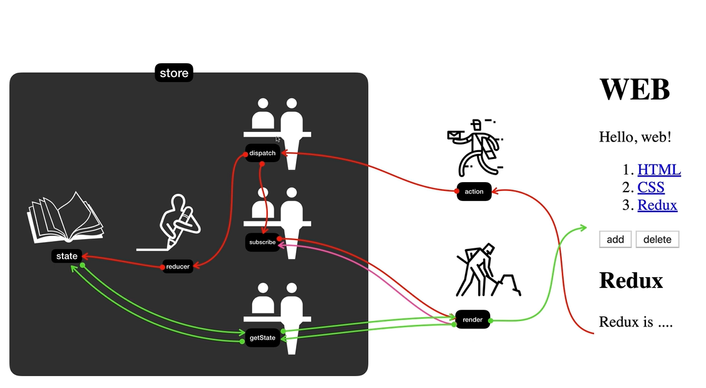
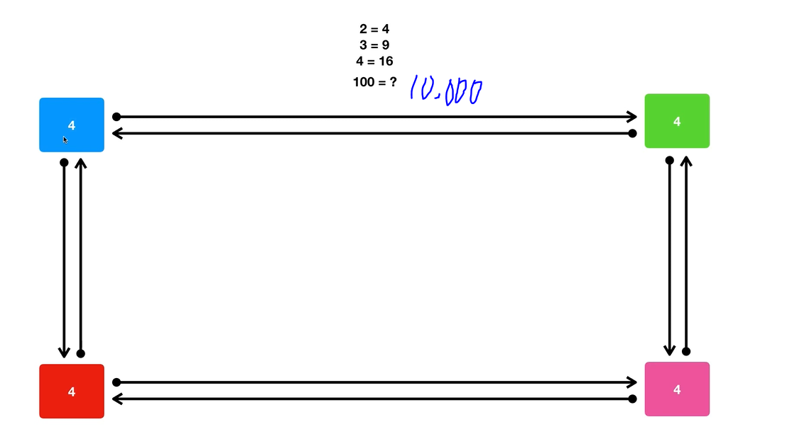
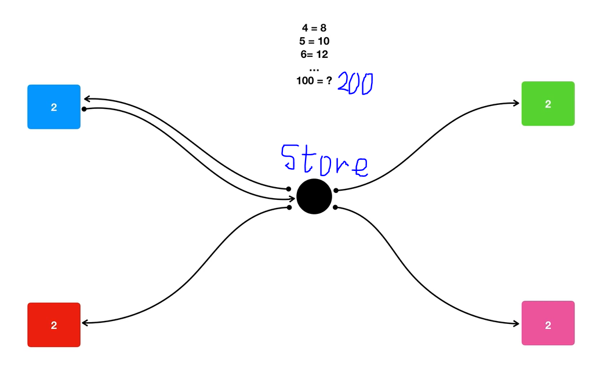
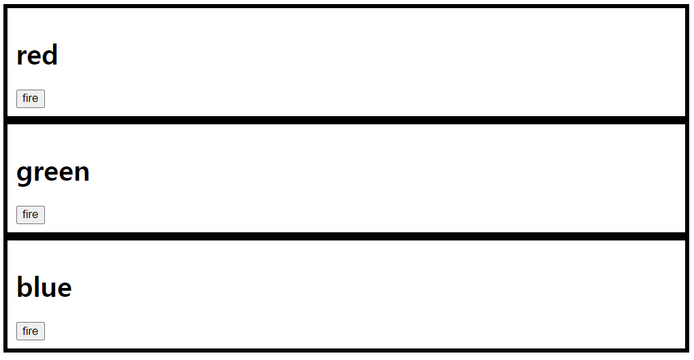
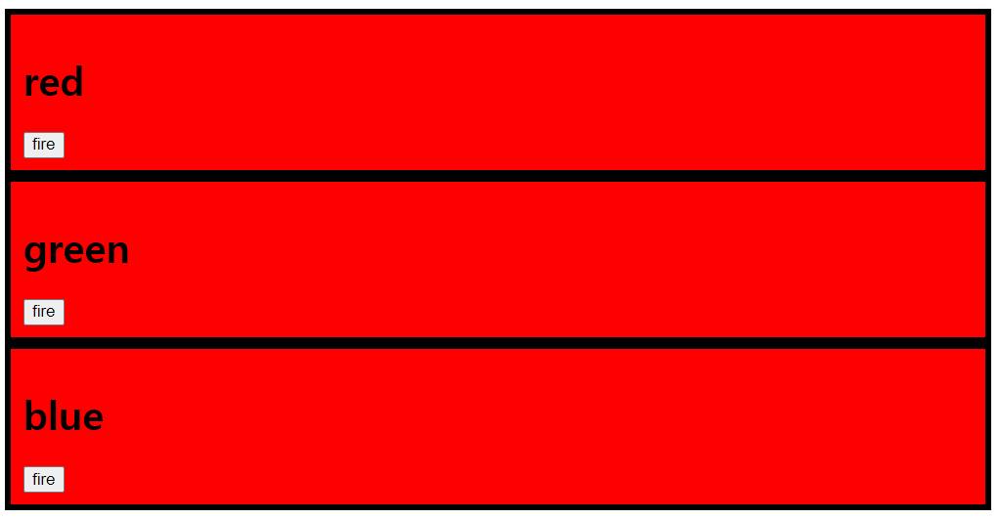
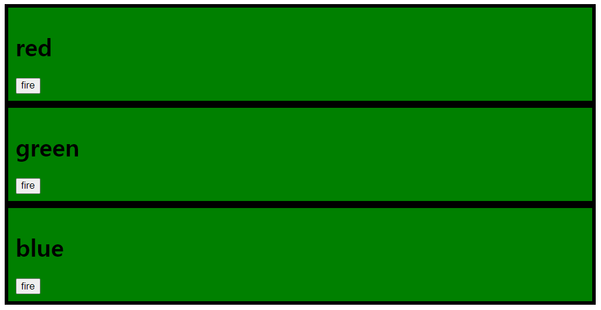
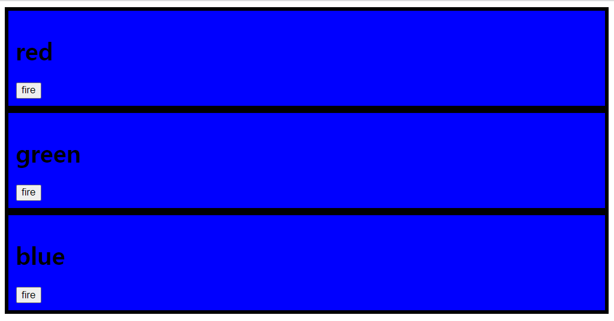

# Redux(공식 문서)
- 자바 스크립트 앱을 위한 예측 가능한 상태 컨테이너
- Redux는 사용자가 일관적으로 동작하고, 서로 다른 환경(서버, 클라이언트, 네이티브)에서 작동하고, 테스트하기 쉬운 앱을 작성하도록 도와줌
- 시간 여행형 디버거와 결합된 실시간 코드 수정과 같은 훌륭한 개발자 경험도 제공
- 사용자는 Redux를 React나 다른 뷰 라이브러리와 함께 사용할 수 있음
- 매우 작지만(의존 라이브러리 포함 2KB), 사용 가능한 애드온(프로그램의 기능을 보완하기 위해 추가하는 보조 프로그램, 플러그인과 유사한 개념)이 매우 많음

## 설치
### Redux Toolkit
- Redux 로직을 작성하기 위해 Redux에서 공식적으로 추천하는 방법
- RTK는 Redux 앱을 만들기에 필수적으로 여기는 패키지와 함수들을 포함
- RTK는 저장소 준비, Reducer(이전 상태와 동작을 받아 새 상태를 리턴하는 순수 함수. 순수 함수란 동일한 인자가 들어오면 항상 같은 값이 나와야 하고, return 값으로만 소통하고, 데이터베이스 호출이나 HTTP 호출 등 외부의 데이터 구조를 변형하는, 호출을 허용하지 않는 함수) 생산과 불변 수정 로직 작성, 상태 조각 전부를 한 번에 작성하는 등 일반적인 작업들을 단순화해주는 유틸리티를 포함하고 있음
- 더 나은 Redux 코드를 만들게 도와줌  
<hr>

- Redux Toolkit은 NPM에서 패키지로 받아 모듈 번들러나 Node 앱에서 사용 가능
```
# NPM
npm install @reduxjs/toolkit

# Yarn
yarn add @reduxjs/toolkit
```

### React Redux 앱 만들기
- React와 Redux로 새 앱을 만들기 위해 추천하는 방법은 Create React App을 위한 공식 Redux + JS 템플릿을 사용하는 것
- 이를 통해 Redux Toolkit와 React Redux가 React 컴포넌트와 통합되는 이점을 누릴 수 있음
```
npx create-react-app my-app --template redux
```

### Redux 코어
- Redux 코어 라이브러리는 NPM에서 패키지로 받아 모듈 번들러나 Node 앱에서 사용 가능
```
# NPM
npm install redux

# Yarn
yarn add redux
```
- window.Redux 전역변수를 선언해주는 UMD 패키지도 사용 가능
- UMD 패키지는 script 태그로 바로 사용 가능

### 기본 예제
- 앱의 상태 전부는 하나의 저장소(store) 안에 있는 객체 트리에 저장됨
- 상태 트리를 변경하는 유일한 방법은 무엇이 일어날지 서술하는 객체인 액션(action)을 보내는 것뿐
- 액션이 상태 트리를 어떻게 변경할 지 명시하기 위해 우리는 Reduces를 작성해야 함
```
import { createStore } from 'redux'

/**
 * 이것이 (state, action) => state 형태의 순수 함수인 리듀서
 * 리듀서는 액션이 어떻게 상태를 다음 상태로 변경하는지 서술함
 *
 * 상태의 모양은 사용자 마음대로 기본형(primitive) 또는 배열 또는 객체로 결정할 수 있음
 * 심지어 Immutable.js 자료구조일 수도 있음
 * 오직 중요한 점은 상태 객체를 변경해서는 안되며, 상태가 바뀐다면 새로운 객체를 반환해야 함
 *
 * 이 예제에서 `switch` 구문과 문자열을 썼지만, 사용자는 프로젝트에 맞게
 * (함수 맵 같은) 다른 컨벤션을 따라도 괜찮음
 */

function counter(state = 0, action) {
  switch (action.type) {
    case 'INCREMENT':
      return state + 1
    case 'DECREMENT':
      return state - 1
    default:
      return state
  }
}

// 앱의 상태를 보관하는 Redux 저장소를 만듦
// API로는 { subscribe, dispatch, getState }가 있음
let store = createStore(counter)

// subscribe()를 이용해 상태 변화에 따라 UI가 변경되게 할 수 있음
// 보통은 subscribe()를 직접 사용하기보다는, 뷰 바인딩 라이브러리(예를 들어 React Redux)를 사용함
// 하지만 subscribe()는 현재 상태를 localStorage에 영속적으로 저장할 때 편리함
store.subscribe(() => console.log(store.getState()))

// 내부 상태를 변경하는 유일한 방법은 액션을 보내는 것뿐
// 액션은 직렬화할 수도, 로깅할 수도, 저장할 수도 있으며, 나중에 재실행할 수도 있음
store.dispatch({ type: 'INCREMENT' })
// 1
store.dispatch({ type: 'INCREMENT' })
// 2
store.dispatch({ type: 'DECREMENT' })
// 1
```
- 상태를 바로 변경하는 대신, 액션이라 불리는 평범한 객체를 통해 일어날 변경을 명시
- 그리고 각각의 액션이 전체 애플리케이션의 상태를 어떻게 변경할지 결정하는 특별한 함수인 리듀서를 작성
- 보통 Redux 앱에는 하나의 루트 리듀서 함수를 가진 단 하나의 저장소가 있음
- 앱이 커짐에 따라 루트 리듀서를 상태 트리의 서로 다른 부분에서 개별적으로 동작하는 작은 리듀서들로 나눌 수 있음
- React 앱을 하나의 루트 컴포넌트에서 시작해서 여러 작은 컴포넌트의 조합으로 바꾸는 것과 동일
- 이런 아키텍처가 카운터 앱에서는 너무 과한 것처럼 보이지만, 크고 복잡한 앱에서는 이 패턴의 확장성이 잘 드러남
- 액션에 따른 모든 변경을 추적할 수 있기 때문에, 매우 강력한 개발자 도구를 가능하게 해주기도 함
- 사용자는 사용자 세션을 기록한 다음, 액션 하나하나를 다시 실행해 볼 수 있음

<br>

[출처 : https://ko.redux.js.org/introduction/getting-started]

# Redux(생활 코딩)
- 자바 스크립트 앱을 위한 예측 가능한 상태 컨테이너
- 예측 가능 : Redux는 애플리케이션의 복잡성을 획기적으로 낮춰 우리의 코드가 어떤 결과를 가져올 지 예측 가능하게 만듦
- Redux는 하나의 상태를 가짐
  - 하나의 state(객체) 안에 애플리케이션에서 필요한 데이터를 모두 욲여넣음(중앙 집중적으로 관리) -> 애플리케이션의 복잡성을 낮춤
- 외부로부터 차단시킴(삼엄하게 데이터를 수정하는 것을 차단 - 인가된 담당자만 가능)
  - 데이터를 수정하려면 디스패처, 리듀서를 통해서만 가능
  - 데이터를 가져오려면 getState를 통해서만 가능
- 데이터를 외부에서 직접적으로 제어할 수 없도록 만듦으로써, 예기치 않게 state의 값이 바뀌는 문제를 사전에 차단함 -> 예측 가능하게 만듦
- state의 값이 바뀔 때마다 데이터를 사용하는 부품들에게 전달
- 실행 취소(UNDO)와 재실행(REDO)을 굉장히 쉽게 할 수 있음(각각 상태의 변화가 서로에게 영향을 주지 않기 때문. 각각의 state 값을 생성할 때 철저히 통제할 뿐만 아니라, 데이터를 만들 때, 원본을 가지고 있는게 아니라 원본을 복제하고, 이를 수정한 데이터를 새로운 원본으로 만들고 있기 때문)
- 디버거를 이용하면 현재뿐만 아니라 이전의 상태까지 꼼꼼하게 리코딩할 수 있어, 문제 해결을 휠씬 더 쉽게 할 수 있도록 도와줌
- 모듈 리로딩할 수 있음 : 코드를 작성하면 우리가 만들고 있는 애플리케이션에 자동적으로 반영됨

## 리덕스 여행의 지도
  

- 리덕스의 핵심은 store
- store는 정보가 저장되는 곳(state, reducer)
  - store 안에는 state가 있는데, 그 state에는 실제 정보가 저장. 우리는 state를 직접 건드리면 안됨
  - store를 만들 때, 리듀서를 만들어서 공급해줘야 함  

    ```
    function reducer(state, action) {
      // ...
    };
    var store = Redux.createStore(reducer);
    ```

- render : UI를 만들어주는, 우리가 작성할 코드  
  ```
  function render() {
    var state = store.getState();
      ///...
      document.querySelector('#app').innerHTML = `
        <h1>WEB</h1>
        ....
      `
  }
  ```  

- subscribe : state의 값이 바뀔 때마다, render 함수 호출되어 UI가 새롭게 갱신
  ```
  store.subscribe(render);
  ```  
  
- action
  ```
  // submit 버튼
  <form onsubmit = "
  // ...
  store.dispatch({type: 'create', payload: {title: 'title, desc: desc}});
  ">
<hr>

1. getState를 통해 값을 가져오고, dispatch를 통해 값을 변경하고, subscribe를 통해 값이 변경되었을 때 구동할 함수 등록
2. reducer를 통해 state의 값을 변경

## Redux가 좋은 가장 중요한 이유
  - Redux 도입 전  

      

    - 부품을 넣고 빼는 일은 여간 쉬운 일이 아님
    - 각각의 부품이 서로에게 강하게 연결되어 있는 경우
    - 해당 경우는 4개의 부품인 것이 아니라 하나의 전체인 것임. 하나는 일부인 것임
    - 코드의 복잡성이 높아짐  
    <hr>

  - Redux 도입 후  

      

    - 하나의 부품이 달라지면 store에 알림
    - store는 자신을 구독하고 있는 부품들에게 상태가 달라졌으니 알아서 바꾸라고 함
    - 각 부품 당 로직이 2개만 필요
    - 애플리케이션이 도입 전보다 단순해짐
  
  - time traveling(현재 상태와 이전 상태 모두 볼 수 있음. 시간 여행 가능)

## Redux 없이 애플리케이션 만들기
### Redux/without_redux.html

- 버튼 누르기 전
  

- 첫번째 버튼 눌렀을 때 
  

- 두번째 버튼 눌렀을 때
  

- 세번째 버튼 눌렀을 때


[출처 : https://opentutorials.org/course/4901]