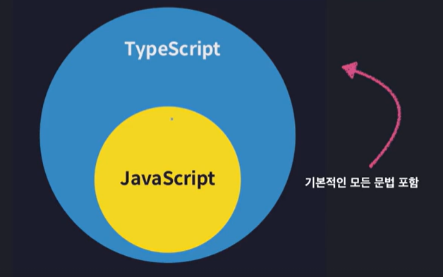
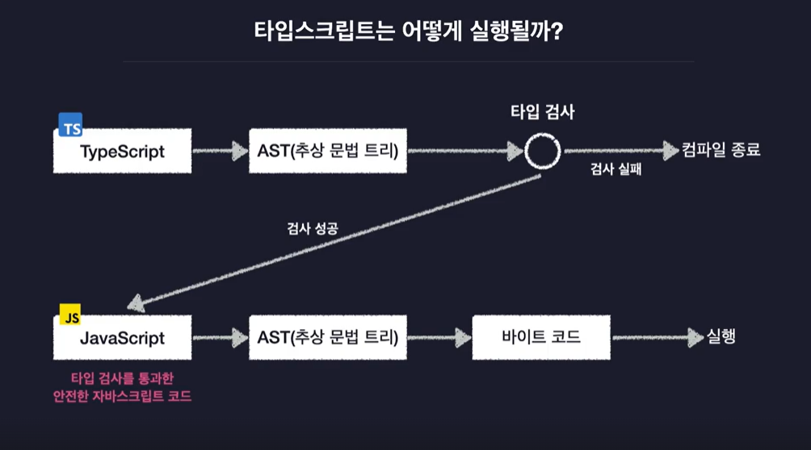
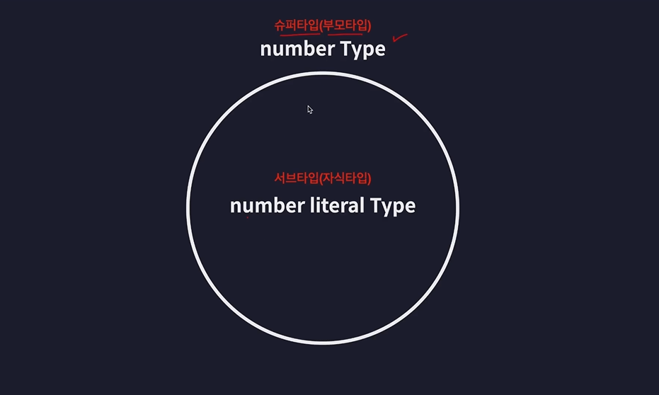
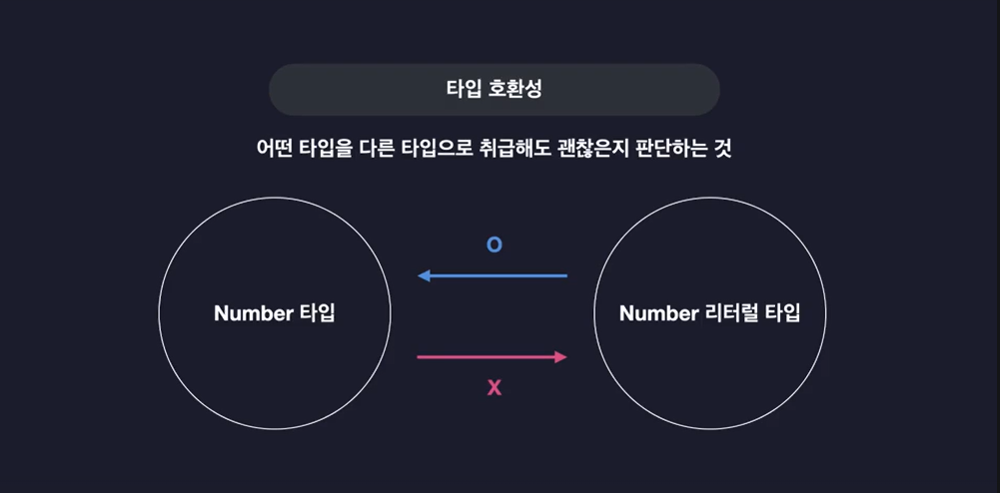
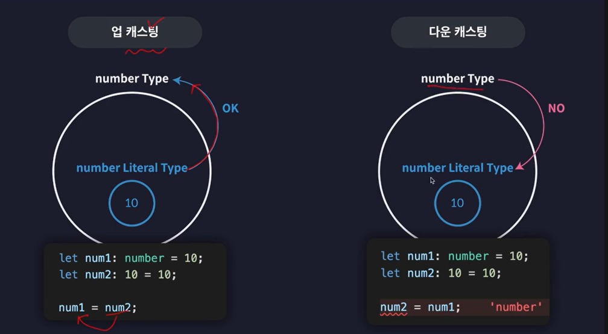
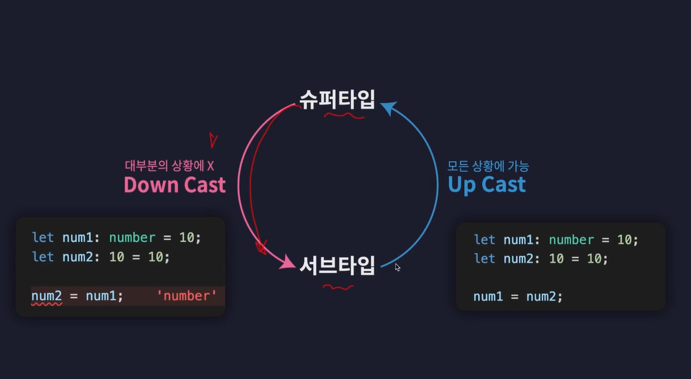
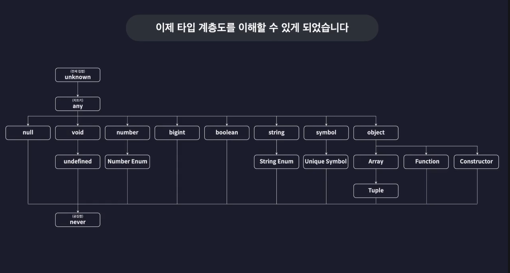

# TypeScript
- 자바스크립트의 확장판
- 타입스크립트는 모든 타입스크립트 파일을 전역 모듈로 봄  
  - 전역 모듈로 본다는 것은 다른 파일이어도 모두 같은 공간에 있다고 본다는 뜻
- 자바스크립트를 더 안전하게 사용할 수 있도록 '타입 관련 기능'들을 추가한 언어
- 점진적 타입 시스템 : 실행 전 검사를 통한 타입 안정성 확보, 자동으로 변수의 타입을 추론함
  
<hr>

- 자바스크립트는 유연한 문법으로 자유로웠지만, 버그 발생 가능성 높았음
- 하지만 node.js(자바스크립트 구동기(런타임))의 등장으로 어디서든 자바스크립트를 구동할 수 있게 됨
- 무엇이든 자바스크립트로 만들 수 있음
- 더 안정적으로 자바스크립트를 사용하기 위해 타입을 추가한 타입스크립트를 사용하게 됨
- 자바스크립트는 동적 타입 시스템(변수의 타입이 하나로만 고정되지 않아, 아무 타입의 값이나 자유롭게 담을 수 있음)
- 그렇기에 오류가 발생했는데도, 실행은 됨
<hr>

- 타입스크립트는 이런 자바스크립트의 단점을 극복함
- 동적 타입 시스템(변수 타입을 실행 전에 결정, 타입 오류를 실행 전에 검사) + 정적 타입 시스템(코드를 실행하기 전에 정적으로 변수의 타입을 결정) => 점진적 타입 시스템(모든 변수에 타입을 일일이 지정할 필요 없음)

<hr>



## 컴파일러 옵션
- 얼마나 엄격하게 타입 오류를 검사할지
- 자바스크립트 코드의 버전은 어떻게 할지
- tsc --init : created a new tsconfig.json
### comilerOptions
- target
  - ES5 --> 화살표 함수가 없음
  - ESNext --> 화살표 함수 있음
- outDir
  - compile의 결과가 디렉토리가 생성되며 원하는 디렉토리 안에 들어감
- strict
  - 타입스크립트 컴파일러가 타입을 검사할 때, 얼마나 엄격하게 검사할건지 결정함. 중요함!!
  - true는 엄격하게 검사
- moduleDetection
  - 타입스크립트가 각각의 파일을 어떤 모듈로 감지할 것인지 결정하는 옵션
  - force로 설정하면, 모든 파일을 개별 모듈로 취급
    - 일일이 모든 파일에 export import를 쓸 필요 없음
<hr>

- npm i ts-node -g
  - ts-node src/index.ts
  - ts-node를 설치해서, 바로 타입스크립트 파일을 실행함

## 타입 호환
- 타입스크립트가 말하는 type은 집합
- 집합 : 동일한 속성과 특징을 갖는 여러 개의 값들을 모아놓은 것  


<hr>
  

ex) Number 타입 : 직사각형, Number 리터럴 타입 : 정사각형  
<hr>

<hr>

<hr>
  


```
// unknown 타입
function unknownExam() {
  // 업캐스트 가능
  let a: unknown = 1;
  let b: unknown = "hello";
  let c: unknown = true;
  let d: unknown = null;
  let e: unknown = undefined;

  // 다운캐스트 불가능
  let unknownVar: unknown;
  let num: number = unknownVar;  // Type 'unknown' is not assignable to type 'number'.
  let str: string = unknownVar;
  let bool: boolean = unknownVar;
}

// Never 타입(불가능, 모순 의미) --> 공집합
// 모든 타입의 서브 타입
function neverExam() {
  // 함수가 어떤 값을 반환하는 것 자체가 불가능할 때
  // 반환할 수 있는 값의 종류가 아무것도 없음
  function neverFunc(): never {
    while (true) {}
  }

  // 업캐스트 가능
  let num: number = neverFunc();
  let str: string = neverFunc();
  let bool: boolean = neverFunc();

  // 다운캐스트 불가능
  let never1: never = 10;  // Type 'string' is not assignable to type 'never'
  let never2: never = "string";
  let never3: never = true;
}

// void 타입
// void 타입은 undefined 타입의 슈퍼타입
function voidExam() {
  function voidExam(): void {
    console.log("hi");
    // return undefined;
  }
  
  let voidVar: void = undefined;
}

// any 타입
// any 타입은 모든 타입의 슈퍼타입
// any 타입은 never를 제외한 모든 타입의 서브타입
function anyExam() {
  let unknownVar: unknown;
  let anyVar: any;
  let undefinedVar: undefined;
  let neverVar: never;
  
  // 업캐스트 가능
  anyVar = unknownVar;

  // 다운캐스트 가능
  undefinedVar = anyVar;

  // 하지만 never 타입으로 다운캐스트할 순 없음
  neverVar = anyVar;
}
```

<br>

[출처 : 인프런 이정환님 TypeScript 강의]