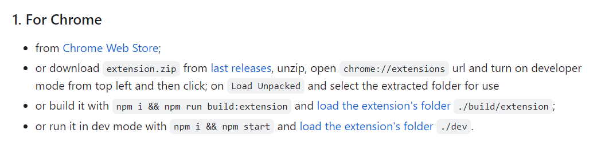

# Redux
## Redux를 이용해서 애플리케이션 만들기
- 각각의 부품들은 상태가 바뀌면 action을 store에게 dispatch해줌
- 자신은 어떻게 변화해야 하는지 코드를 작성해놓고
- 그것을 store에 구독시켜놓으면(subscribe) 됨

### Redux/with_redux.html

```
// 첫번째 객체는 반드시 빈 객체가 되어야 함
// Object.assign의 return 값은 첫번째 객체이기 때문

Object.assign({}, {name: 'egoing'}, {city: 'seoul'})
---> {name: 'egoing', city: 'seoul'}
```

## Redux 선물 - 시간여행 디버깅
### Redux DevTools
- https://github.com/zalmoxisus/redux-devtools-extension
  

- 그 후, 아래 코드 입력
```
  const store = createStore(
  reducer, /* preloadedState, */
+  window.__REDUX_DEVTOOLS_EXTENSION__ && window.__REDUX_DEVTOOLS_EXTENSION__()
);
```
- 밑에 'Go Live' 눌러서 확인하기
<hr>

- Redux는 store를 통해 상태 관리
- time travel
- 원본(state)을 변경하면 안됨. 불변해야 함

## 실전 Redux - CRUD 앱 만들기
### Redux/main.html

[출처 : https://opentutorials.org/course/4901]