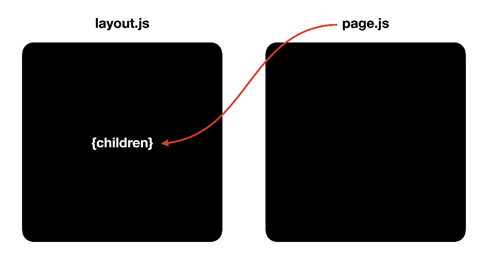
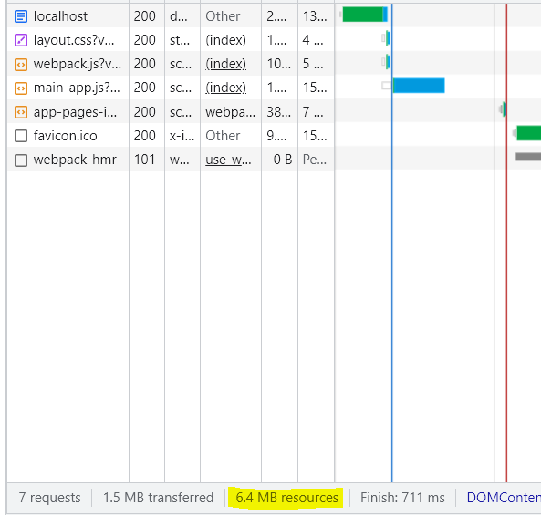
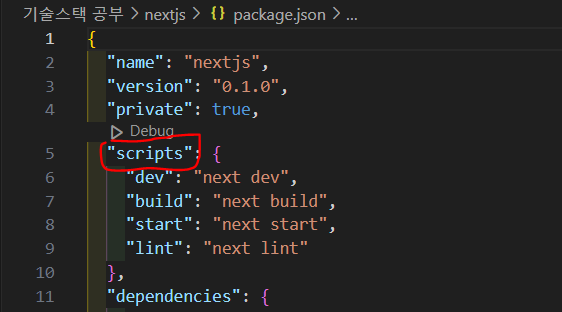
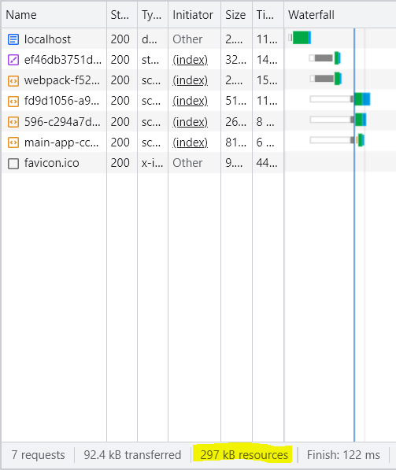
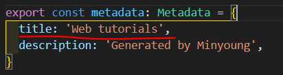
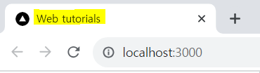

# Next.js
- The React Framework for the Web
- Frontend(React), Backend(Expressjs와 비슷한 형태) 기능을 모두 가지고 있음
- web Application을 만드는 도구
- Server Side Rendering 지원  
  서버 쪽에서 자바 스트립트 실행(자바 스크립트를 실행할 수 없는 환경에서도 잘 동작함)

## Next.js 설치, 실행
### 설치(VSCode, Node.js 설치 필요)
- 새로운 폴더를 생성(폴더명에 대문자 들어가면 안 됨)
- 터미널을 열고 새로 생성한 폴더로 이동
- 다음 명령어를 터미널에 입력하여 Next.js 설치
```
npx create-next-app@latest .
```
- Typescript : Yes  
ESLint : Yes  
Tailwind CSS : Yes
src/ directory : Yes  
App Router : Yes  
import alias : No  

### 실행
- 설치한 Next.js를 실행하기 위해 터미널에 다음 명령어를 입력
```
npm run dev
```
- 브라우저를 열고 아래 주소에 접속
```
http://localhost:3000/
```

## 샘플 앱 세탁


### 레이아웃 세탁
레이아웃은 모든 페이지가 공유하는 HTML 코드가 담겨 있음
- src/app/layout.tsx 파일을 열어줌
```
import './globals.css'
import type { Metadata } from 'next'

export const metadata: Metadata = {
  title: 'Create Next App',
  description: 'Generated by create next app',
}

export default function RootLayout({
  children,
}: {
  children: React.ReactNode
}) {
  return (
    <html>
      <body>{children}</body>
    </html>
  )
}
```

### 콘텐츠 세탁
레이아웃에 포함될 콘텐츠가 담겨 있음
- src/app/page.tsx 파일을 열어줌
```
import Image from 'next/image'

export default function Home() {
  return (
    <>
      Hello, Next.js!
    </>
  )
}
```

### global css 세탁
모든 사이트에 적용될 디자인이 담겨 있음
- src/app/global.css 파일의 모든 내용을 지워줌

## 빌드와 배포


- 서버에서 클라이언트로 전송한 resources의 용량이 6.4MB
- 용량이 굉장히 큰 편임
- 비효율적이고, 때론 보안 상의 문제가 발생할 수 있음
- 용량을 작게 줄이고, 불필요한 메시지를 출력하지 않는 실 서버에 최적화된 버전이 필요
<hr>

  

- 개발 환경을 끔(터미널에서 Ctrl + C를 누름)
- build : 실 서버를 위한 배포판을 만드는 명령  
다음 명령어를 터미널에 입력하여 배포 가능한 버전의 애플리케이션을 생성
    ```
    npm run build
    ```
  - .next는 사용자에게 서비스되는 내용이 저장되는 폴더
  - 배포판이 .next 폴더에 만들어짐  
  <br>

- start : 이 배포판을 서비스하는 명령  
생성된 배포 버전을 실행하기 위해 터미널에 다음 명령어를 입력
    ```
    npm run start
    ```  
    <br>

- .next 폴더의 내용을 바탕으로 서비스를 시작
    ```
    http://localhost:3000
    ```
  

  - 굉징히 큰 용량 차이가 생김(6.4MB -> 297KB)

## 뼈대 만들기 - layout & page



## Next.js의 도로교통 시스템 - Routing
### 용어 정리
사용자가 접속한 URL의 path(경로)에 따라서 콘텐츠를 응답해주는 작업을 라우팅이라고 함  
어떤 프레임워크든 그 중심에는 반드시 라우팅이 있음
- 예를 들어, "http://a.com/dashboard/analytics/"라는 주소가 있을 때
- "/dashboard/analytics/" 부분을 'path'라고 하고
- 'dashboard'와 'analytics'는 각각 'segment'라고 부름


## 절차
페이지를 만드는 방법은 다음과 같음
1. 처음에 "/create"로 접속하면 "Not Found"가 출력됨
2. 이를 해결하기 위해 src/app 아래 create 폴더 만듦
3. 그리고 page.tsx 파일 생성
```
export default function Create() {
  return(
    <>
      Create!!
    </>
  )
}
```
4. "/create"로 다시 접속하면 정상적으로 페이지가 출력됨

### 알 수 있는 것
1. pages 아래의 폴더는 세그먼트를 의미함. /create는 pages/create 폴더를 의미함
2. pages/create.tsx 파일이 있다면, 이 파일의 반환 값을 화면에 출력함
3. 이 값을 상위 컴포넌트인 nextjs/layout.tsx의 children 위치에 표시됨
4. 이때, nextjs/page.tsx는 무시됨

[출처 : https://opentutorials.org/course/5098]